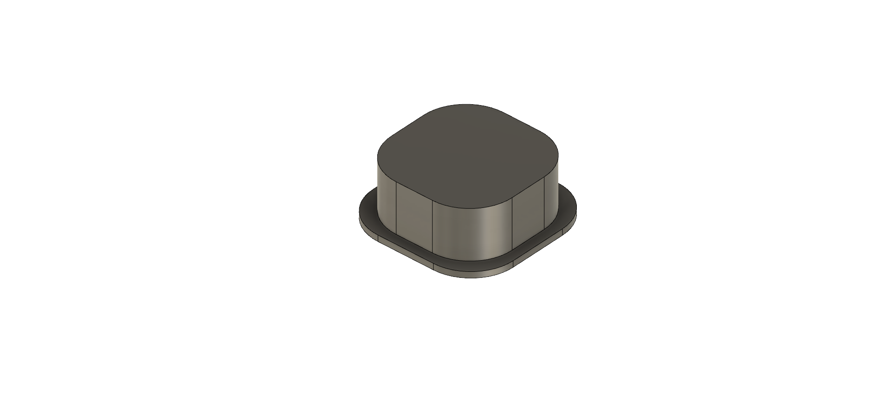

# Tactile button Cap

Made with [Autodesk Fusion 360](https://www.autodesk.fr/products/fusion-360/overview).

## User parameters

* `capSize (mm)`: Length and width of the cap.
* `capRadius (mm)`: Radius of the rounder corners of the cap.
* `capHeight (mm)`: Height of the cap.
* `buttonSize (mm)`: Length and width of the tactile button (ie size of the inner square).
* `buttonHolderLength (mm)`: Length of holders inside the the cap.
* `buttonHolderWidth (mm)`: Width of holders inside the the cap.
* `buttonHolderHeight (mm)`: Height of holders inside the the cap.
* `collarSize (mm)`: Width of the collar. (0.8mm is recommended to print it without support).
* `collarHeight (mm)`: Thickness of the collar.

## License

