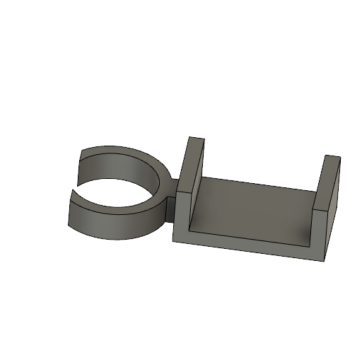
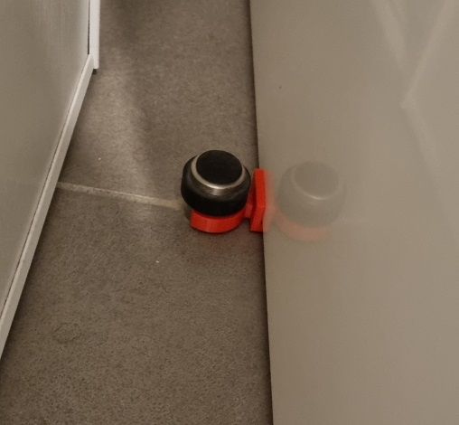

# Door holder

Made with [Autodesk Fusion 360](https://www.autodesk.fr/products/fusion-360/overview).

Door holder using door stop.

## User parameters

* `doorStopDiameter (mm)`: Diameter of the door stop.
* `doorStopHolderThickness (mm)`: Thickness of the door stop holder part.
* `doorStopHeight (mm)`: Height of the door stop holder part.
* `linkLength (mm)`: Length between the door stop holder part and the door holder part.
* `linkThickness (mm)`: Thickness of the link between the door stop holder part and the door holder part.
* `doorHolderHeight (mm)`: Height of the door holder part.
* `doorHolderWidth (mm)`: Width of the door holder part.
* `doorHolderThickness (mm)`: Thickness of the door holder part.
* `doorThickness (mm)`: Width of the door.

## License

